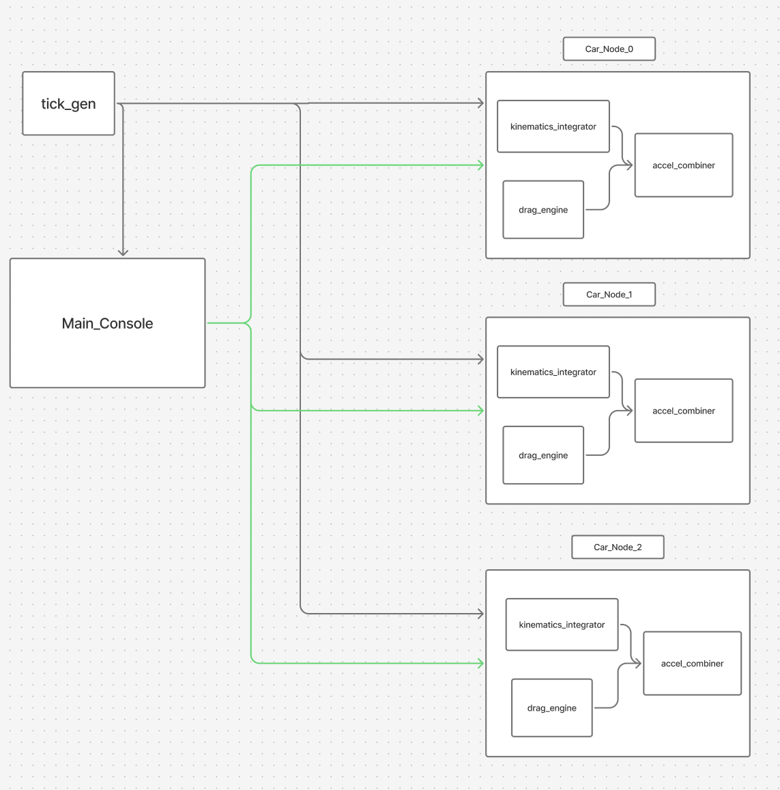

# AMVLS

AMVLS is a small SystemVerilog project that models a multi car lane scenario using a tick based update flow.
The repository is intentionally minimal: a top module, a “main console” controller, and a per car node built from a few physics blocks.



## What’s in this repo

Media:
- `Car Simulation Visualization.mp4` — a short demo video of the simulation output
- `General_blocking.png` — high-level block diagram

SystemVerilog sources:
- `amvls_top.sv` — top level that wires everything together
- `main_console_N_Car.sv` — the central controller for N cars (parameterized)
- `car_node.sv` — a single car node (physics + command handling)

Building blocks (used inside the car node):
- `amvls_tick_gen.sv` — tick generator (creates the periodic “update” pulse)
- `tick_if.sv` — tick interface definition
- `drag_engine.sv` — drag related computation block
- `accel_combiner.sv` — combines commanded acceleration with drag effects
- `kinematics_integrator.sv` — integrates acceleration/velocity/position per tick
- `amvls_pkg.sv` — shared package (types/parameters/helpers)

## How to simulate

No scripts are included in this repo. A simple way to run:
1. Create a new simulation project in your preferred SystemVerilog capable tool.
2. Add all `*.sv` files from the repository.
3. Set `amvls_top.sv` as the top module.
4. Run simulation and view signals (position/velocity/command paths) as needed.

## Notes

- File/module intent is reflected by filenames and the block diagram.
- The project is focused on a clean, readable RTL structure rather than a full build system.

## Demo

Open `Car Simulation Visualization.mp4` to see a quick visualization of the scenario.
```13
